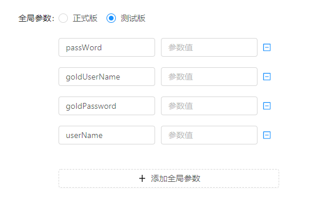
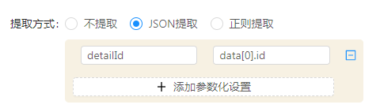
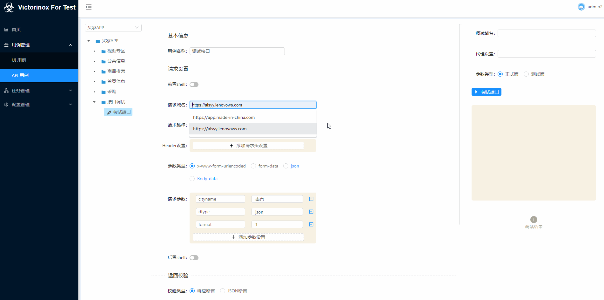

# 接口自动化用例

## 用例树结构

- 用例树分为3层，鼠标右键出操作菜单：项目、模块分类、测试用例
- **项目**：在此设置[**全局参数设置**](/api-case/#_3)
- **模块分类**：这个只是为了使树更加清晰，在实际生成jmeter可执行文件时，并不会受这个影响。
- **测试用例**：测试用例对应jmeter的http sample，包含用例的基本信息、请求设置、返回校验、参数化设置、调试用例等。

## 项目全局参数设置
### 全局参数

{.img-fluid tag=1}

全局参数在当前项目下，用例编辑中可以自动联想搜索。 
这里参数分为2个类型：正式版、测试版

{.img-fluid tag=2}

## 请求设置

字段描述：

| 字段名称 | 描述信息 |
| :-- | :-- |
| 前置shell | 对应jmeter里的前置beanshell，java语法。 可以自己加载扩展的jar包，参见：[**接口自动化扩展**](/api-plugin/) |
| 请求域名 | 这里不是必填的，如果任务里设置了全局域名会取全局的，如果用例中设置了优先取用例中的。 |
| 请求路径 | 请求类型目前只开放了GET、POST，请求中如果有动态组成的，可以通过"/list/$\{xxxx\}"组成 |
| Header设置 | 单个用例的请求头设置，键值对形势设置。参数值支持联想本项目的全局参数、参数化参数 |
| 参数类型 | 这个主要是为了适应不同格式的参数格式，支持参数值的搜索联想。 选择了json、body-data时，请求头会自动增加‘Content-Type: application/json’，且不支持任务中全局默认参数。 |
| 请求参数 | 键值对形势设置，Body-data类型时，这里是json格式的参数。 |
| 后置shell | 对应jmeter里的前置beanshell，java语法。 可以自己加载扩展的jar包，参见：[**接口自动化扩展**](/api-plugin/) |

## 返回校验

这里支持2种类型的返回值校验：

**响应断言**： 对应Jmeter中的响应文本断言，断言响应的文本中是否存在指定字符。支持多组文本断言。

**JSON断言**：    键值对形势，支持多组断言，注意返回值需为json格式数据。  key: 要校验的返回值路径，如：`data[0].name`   value: 值应该是什么，如：`test1`

## 参数化设置

默认不提取当前返回值做参数化，支持JSON路径提取、正则提取：

### **JSON提取**
 如果是列表根据下标获取，支持多组数据提取。    

### **正则提取**
 如果有多个匹配结果，默认取的第一个，支持多组数据提取。  

## 调试用例

这个功能主要是为了写用例时，对当前用例进行调试验证用的，改变了原来用request模拟的方式，现在调试也用的Jmeter执行用例。

{.img-fluid tag=3}
