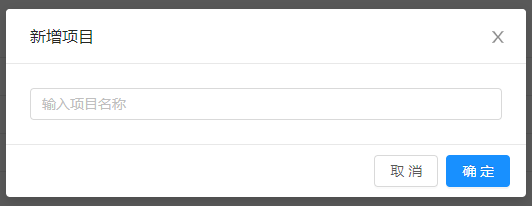

# 接口自动化项目配置
创建一个项目。

## 新建项目
点击“新建项目”，输入项目名称创建项目。

## 项目信息

| 字段名称 | 描述信息 |
| :-- | :-- |
| 项目名称 | 项目名称描述 |
| 用例数量 | 统计的是该项目下所含的用例 |
| 创建人 | 项目的创建人 |
| 创建时间 | 项目的创建时间 |
| 操作 | 默认为可用状态。   点击“**关闭**”后，项目不可用。   用例编写及任务创建那边都不可选，但不会影响已经创建的任务。 **批量导入**：可以直接导入jmx、har文件，自动生成用例部分的必要数据 |
